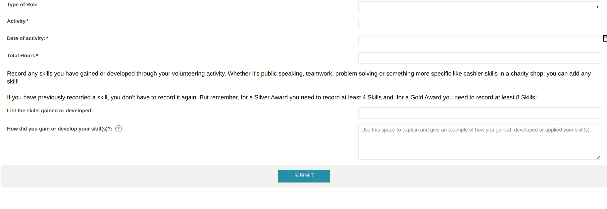
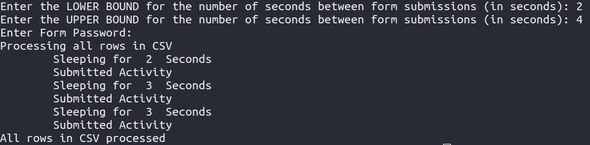

# Aber SU Volunteering Automatic Time Logger
A small Python script to provide an automated solution to logging volunteer hours to the Aberystwyth University Student's Union system. 

### Requirements
Selenium, Chrome Webdriver

## Providing Activities
Activities are defined in a CSV file ([hours.csv](hours.csv)) and the program automatically submits these using the submission form. Processed hours are then added to hours_processed.csv and hours.csv is overwritten.

### Example Activity in hours.csv
``EXAMPLE ACTIVITY,01/01/2020,1,EXAMPLE SKILL GAINED,EXAMPLE OF HOW THIS SKILL WAS DEVELOPED``

## Spam Protection
The script asks both a lower and upper bound in seconds between form submissions. The script sleeps for a randomised time between these values between form submissions to prevent flooding of the form.

## Demo GIFs

